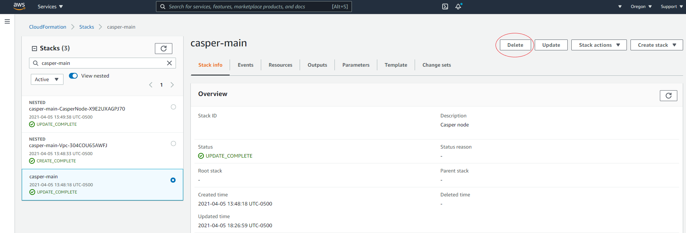
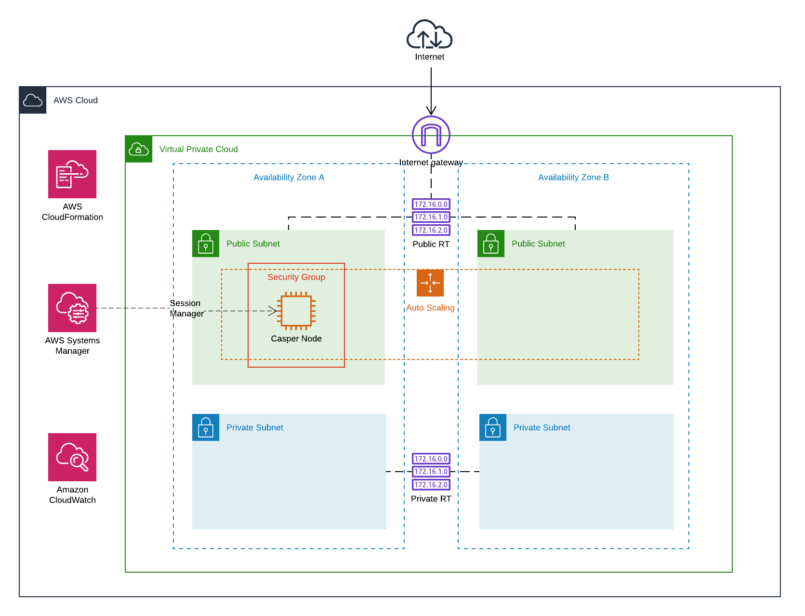

# Casper Node Quickstart

This repository contains CloudFormation templates to deploy and bootstrap a Casper node on AWS.

## Getting Started


### AWS IAM

An AWS IAM user with appropriate resource creation permissions should be used when running the Quickstart. Use of the AWS account's root user is discouraged.

Refer to the AWS documentation on [Security best practices in IAM](https://docs.aws.amazon.com/IAM/latest/UserGuide/best-practices.html)

### Hardware Requirements

Minimum Requirements: 

* CPU: 4 vCPU
* Memory: 32GB
* Disk: 2TB


### Quick Start

You can deploy the infrastructure by selecting one of the regions below, and clicking on the *launch stack* button. Follow the instructions on the AWS console and fill the required parameters to deploy the CloudFormation stack.

|Region||
|-|-|
| us-east-2 | [](https://console.aws.amazon.com/cloudformation/home#/stacks/new?stackName=casper-main&templateURL=https://casper-node-quickstart.s3.us-east-2.amazonaws.com/master.packaged.yml&region=us-east-2) |

### Manual Deployment

You can also download the CloudFormation templates and deploy the infrastructure manually using the *[aws-cli](https://aws.amazon.com/cli/)*:

*Note: You should have already installed and configured the aws cli in order to follow these steps*

1. Create an S3 Bucket to store the CloudFormation templates.
2. Package and upload the templates to S3:

    ```console
    $ aws cloudformation package \
        --template-file master.yml \
        --output-template-file master.packaged.yml \
        --s3-bucket <YOUR_S3_BUCKET>
    ```

3. Create the CloudFormation stack:

    ```console
    $ aws cloudformation deploy \
        --template-file master.packaged.yml \
        --capabilities CAPABILITY_NAMED_IAM \
        --parameter-overrides TrustedHash=<TRUSTED_HASH> OwnerName=<OWNER_NAME> ProjectName=<PROJECT_NAME> \
        --stack-name <STACK_NAME>
    ```

    Choose a meaningful name for you CloudFormation Stack and deploy the infrastructure. 
    *(Note: With the `--parameter-overrides` flag you can specify any of the supported parameters in the template)*


### Monitoring the Node

An AWS CloudWatch dashboard is created as part of the infrastructure with some metrics about the node. You can access the dashboard using the [CloudWatch console](https://console.aws.amazon.com/cloudwatch/home?#dashboards:) or by opening the URL of the dashboard in the CloudFormation stack outputs.

### Accessing the Node

You can securely access the node in two ways:

1. Using AWS Session Manager by opening the [console](https://console.aws.amazon.com/systems-manager/session-manager/sessions) and clicking on *Start Session*, then just select your instance and you will get access to the node through a terminal embbeded in the browser. *(Note: You can also access the node through your terminal by using the aws cli and the session manager plugin)*
2. Using SSH: To enable SSH access to your node you have to provide the *KeyName* and *IpWhiteList* parameters when you create the stack. To access the node, go to the [EC2 Console](https://console.aws.amazon.com/ec2/v2/home?#Instances:search=casper), select the node and click on the *Connect* button, you can find the SSH tab there with sample commands to connect to the instance.

    For more information on how to create an AWS KeyPair check the [AWS docs](https://docs.aws.amazon.com/AWSEC2/latest/UserGuide/ec2-key-pairs.html)
    *It's important that you store the SSH key in a secure place since it provides access to your node.*


### Delete Resources

To completely delete all the resources created by the templates go to the [CloudFormation Console](https://console.aws.amazon.com/cloudformation/home), select your stack and delete it.




## Infrastructure



The CloudFormation templates create the following components as part of the infrastructure:

- A VPC with public and private subnets, and all the routing configuration.
- A single EC2 Instance that bootstraps a Casper node.
- An Instance Role to provide the EC2 Instance with access to Systems Manager & CloudWatch
- A CloudWatch dashboard with metrics to monitor the node.
- Configuration to access the node through Session Manager.

## Backup

During node bootstrap, validator keys are created in `/etc/casper/validator_keys`

These keys should be backed up by the node operator and stored in a secure location. 

[AWS Data Lifecycle Manager](https://docs.aws.amazon.com/AWSEC2/latest/UserGuide/snapshot-lifecycle.html) can be optionally setup by the node operator to schedule periodic backups of the Casper Node EBS disk. As the snapshots will contain sensitive information (validator keys), appropriate IAM access controls should be applied.

## Documentation

[Casper Node](https://docs.casper.network)

[Casper Node Configuration Guide](https://docs.casper.network/operators/setup/basic-node-configuration/)


## Support

[Support Portal](https://support.casperlabs.io)

[Casper Discord](https://discord.gg/casperblockchain)


